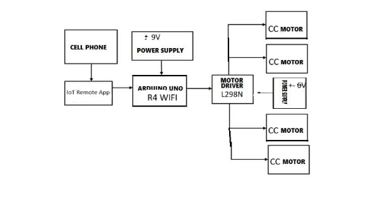
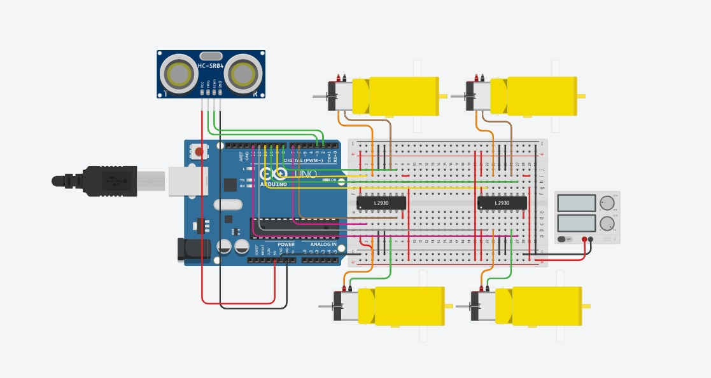

Masina Controlata prin Modul WIFI

| | |
|-|-|
|`Author` | Preda Alexandra

## Description

    Masina este controlata prin intermediul placutei Arduino R4 WIFI. Este capabila sa mearga spre stanga, dreapta, inainte si inapoi fiind controlata prin aplicatia Iot Remote. 
    Senzorul ultrasonic din fata ei (sub forma de “faruri” ale unei masini adevarate) o opreste din a inainta si a se lovi de un obstacol.

## Motivation

    Scopul proiectului a fost de a imbina cunostintele dobandite in decursul laboratoarelor pentru a construi ceva practic ce poate fi utilizat si ca o jucarie.
	Am pornit de la cea mai de baza jucarie a copilariei: o masina teleghidata prin telecomanda, dar adaptata si reimaginata pentru cerintele proiectului.

## Architecture

    Placuta Arduino cu modul WIFI permite accesarea codului in aplicatia Arduino Cloud. Conectand placuta putem actualiza codul si creea diferite interfate pentru a ne face mai usoara utilizarea programului. 
    Deoarece masina se bazeaza pe 4 comenzi (stanga, dreapta, inainte, inapoi), interfata contine 4 butoane. Atunci cand valoarea unui buton este HIGH, functia aferenta lui pune in miscare robotul. Daca nu este apasat niciun buton, toate motoarele vor ramane pe valoarea LOW. 
    Singura exceptie este functia “onInainteChange()”. Daca senzorul ultrasonic detecteaza un obiect pana in 15 cm, valorile motorului vor ramane LOW chiar daca butonul de “inainte” este apasat.

### Block diagram

<!-- Make sure the path to the picture is correct -->

### Schematic

### Components

> -|--------|--------|-------|
-| Activ Buzzer | Buzzer | [1.5 RON](https://www.optimusdigital.ro/ro/audio-buzzere/635-buzzer-activ-de-3-v.html?search_query=buzzer&results=61) |
-| Push Button | Button | [1 RON](https://www.optimusdigital.ro/ro/butoane-i-comutatoare/1119-buton-6x6x6.html?search_query=buton&results=222) |
-| Jumper Wires | Connecting components | [7 RON](https://www.optimusdigital.ro/ro/fire-fire-mufate/884-set-fire-tata-tata-40p-10-cm.html?search_query=set+fire&results=110) |
-| Breadboard | Project board | [10 RON](https://www.optimusdigital.ro/ro/prototipare-breadboard-uri/8-breadboard-830-points.html?search_query=breadboard&results=145) |

4 x Motoare de curent continuu
4 x Roti
4 x Fixari motoare
2 x 250 x 160 x 3mm placa acrilic transparent
1 x L298N Driver (Punte H)
1 x Placa Arduino® UNO R4 WiFi
1 x Set suruburi si piloni hexagonali
1 x Modul Ultrasonic HC-SR04
1 x Suport baterii (4 x AA )
1 x Suport baterie 9V cu mufa 
20 fire Mama Mama

### Libraries
#include "thingProperties.h"

## Log

<!-- write every week your progress here -->

### Week 6 - 12 May

### Week 7 - 19 May

### Week 20 - 26 May

## Reference links

[Resurse Hardware](https://www.sigmanortec.ro/Kit-Smart-Car-4WD-Bluetooth-IR-Ultrasunete-p136281349)

[Inspiratie schema bloc](https://www.researchgate.net/figure/Fig-1-Block-Diagram-of-recently-used-in-robotic-car-construction_fig1_292072427)

[Tutorial](https://www.youtube.com/watch?v=1n_KjpMfVT0)